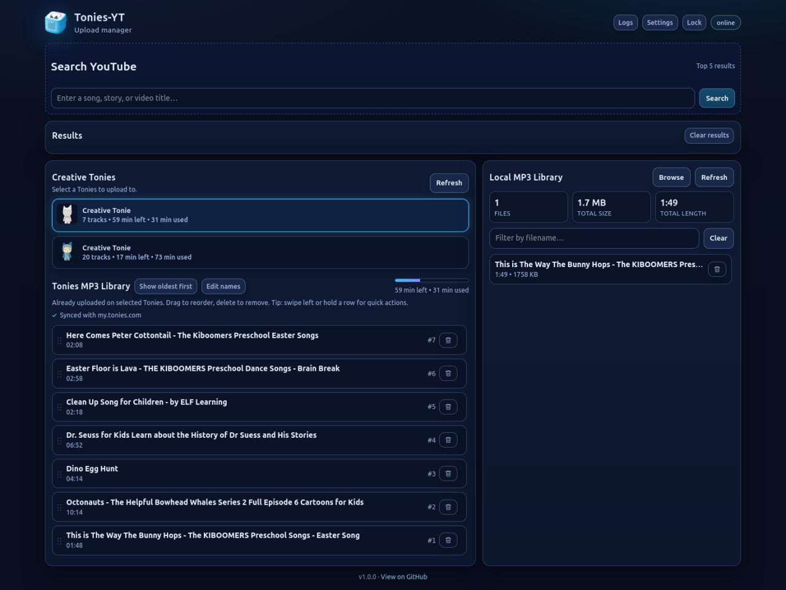

# Tonies-YT

Fast web app for managing Creative Tonies audio.



## What it does
- Search YouTube
- Pick a result
- Download audio
- Upload to `my.tonies.com`
- Manage Tonies library items (rename, reorder, delete, **delete all content**)
- Maintain a Local MP3 Library for drag/drop or upload-to-Tonies flows
- Queue multiple local uploads (sequential, with queued-state highlighting)
- Import local audio into the library with a **Browse** button and normalize it to Tonies-friendly MP3 format
- Right-click local files on desktop for upload actions (upload / upload to top / upload to bottom)

## Main UI
- App: `http://localhost:8090`
- API docs: `http://localhost:8090/docs`
- Logs: `http://localhost:8090/logs`
- Settings: `http://localhost:8090/settings`

## Core features
- Realtime job updates with SSE + fallback polling
- Configurable YouTube result count (5 / 10 / 15 / 20)
- Local vault/login flow for app access
- Tonies credential management in Settings
- Local file uploads + YouTube downloads
- Built-in logs viewer + export

## Stack
- FastAPI
- Playwright (Chromium)
- `yt-dlp`
- `ffmpeg`
- Docker Compose

## Quick start (recommended)
```bash
git clone https://github.com/c1rca/tonies-yt.git
cd tonies-yt
cp .env.example .env
docker compose up -d --build
```

Then open `http://localhost:8090`.

## Windows without Docker Compose
Docker Compose is the easiest path, but a non-Docker Windows setup script is available:

- `scripts/setup-windows.ps1`

Run it from PowerShell:

```powershell
Set-ExecutionPolicy -Scope Process -ExecutionPolicy Bypass
.\scripts\setup-windows.ps1
```

It will:
- optionally install missing system tools (Git / FFmpeg / Deno)
- detect or install Python 3.12
- clone/update the repo
- create `.venv`
- install Python dependencies + Playwright Chromium
- print a verification summary and the server run command

## Required config
Minimal `.env` setup is usually enough as-is.

On first launch, the app will guide you through setup/login and store Tonies credentials in the local vault.

Optional:
- `LOG_LEVEL`
- `LOG_FILE` (default: `/app/data/logs/tonies-yt.log`)
- `TONIES_LOGIN_URL` (advanced override)
- `TONIES_APP_URL` (advanced override)

## Docs
- Quick start: [`docs/QUICKSTART.md`](docs/QUICKSTART.md)
- App overview: [`docs/APP_OVERVIEW.md`](docs/APP_OVERVIEW.md)
- Operations: [`docs/OPERATIONS.md`](docs/OPERATIONS.md)
- Contributing: [`CONTRIBUTING.md`](CONTRIBUTING.md)
