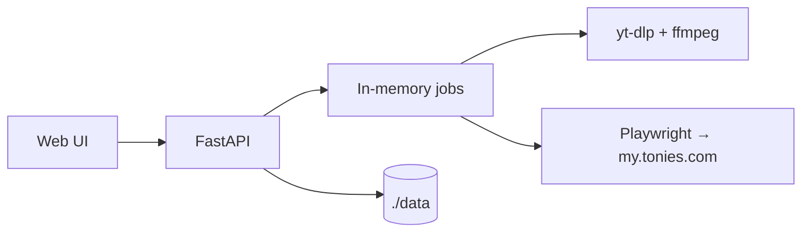

# App Overview

Tonies-YT is a small web app for moving audio onto Creative Tonies with minimal friction.

## Primary flow
1. Search YouTube
2. Pick a result
3. Download audio
4. Upload to `my.tonies.com`
5. Sync the Tonies library view

## UX model
### Search
- Latest search only
- Configurable result count: 5 / 10 / 15 / 20
- Realtime updates with SSE
- Clear progress states
- Search button stays simple while search status is shown in the Results pane
- Starting a new search can replace an in-flight search request

### Tonies library
- Rename tracks
- Reorder tracks
- Delete tracks
- Delete all content (with confirmation)
- Drag local files onto the selected Tonies
- Desktop right-click menu on local files: upload / upload to top / upload to bottom
- Local upload queue (multiple local files processed sequentially)
- Shows free/used minutes clearly

### Settings
- Change app password
- Update Tonies credentials
- View installed tool versions
- Update `yt-dlp` from the UI when available

## Architecture

## Code map
### Backend
- `app/main.py` — routes and API
- `app/jobs.py` — job flow and retries
- `app/uploader.py` — Tonies automation
- `app/downloader.py` — YouTube search/download
- `app/credentials.py` — local vault and login
- `app/config.py` — env config

### Frontend
- `web/index.html` — main app UI
- `web/login.html` — login page
- `web/setup.html` — setup page
- `web/account.html` — settings page
- `web/logs.html` — logs page

## Important data
Stored in `./data`:
- `downloads/`
- `logs/tonies-yt.log`
- `tonies-storage-state.json`

Not stored permanently:
- in-memory job queue/state

## Important endpoints
### Core
- `GET /api/health`
- `POST /api/chat`
- `GET /api/jobs`
- `POST /api/jobs/{job_id}/select`

### Tonies library
- `POST /api/tonies-content`
- `POST /api/tonies-content/delete`
- `POST /api/tonies-content/delete-all`
- `POST /api/tonies-content/reorder`
- `POST /api/tonies-content/rename`

### Files
- `GET /api/files`
- `DELETE /api/files/{filename}`
- `POST /api/upload-existing`

### Setup/auth
- `GET /api/setup/status`
- `POST /api/setup/init`
- `POST /api/setup/login`
- `POST /api/setup/lock`
- `POST /api/setup/change-password`
- `POST /api/setup/update-tonies-credentials`
- `POST /api/setup/update-yt-dlp`
